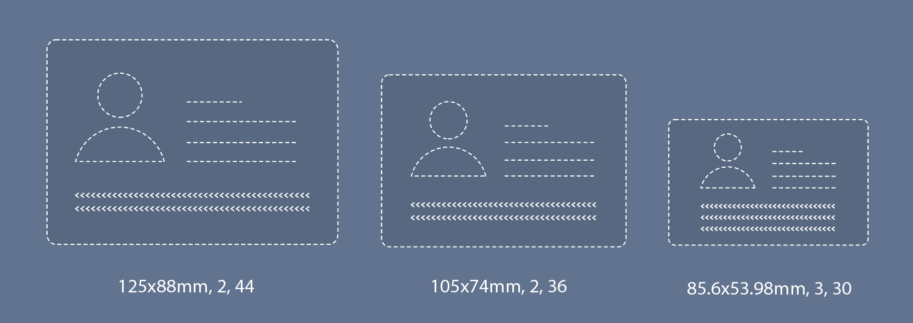

# Customizing the MRZ Scanner for Web

>**Prerequisite**
>
>Before going into the ways that you can customize the MRZ Scanner, please read the [User Guide for MRZ Scanner for Web](mrz-scanner.md).

This guide expands on the User Guide that explored the Hello World implementation. We will now address how you can customize the UI as well as the performance of the MRZ Scanner. We will walk through the three main configuration interfaces - **MRZScannerConfig**, **MRZScannerViewConfig**, and **MRZResultViewConfig**.

## MRZScannerConfig Overview

**MRZScannerConfig** is used to define the essential configurations needed to make the MRZ Scanner work. Let's break down each of the properties that make up the MRZScannerConfig:

1. **license** - This is the one property that is ***absolutely required to be set when the MRZ Scanner is being initialized***. If the license is undefined, invalid, or expired, the user will be met with an alert message informing them to contact the site administrator to resolve this license issue and they will not be able to proceed with the operation.

2. **container** - In order to get the entire MRZ Scanner workflow to be contained inside a certain DOM element, then this DOM element must be assigned to this property. If it is not specified (like in the [Hello World sample] that the [User Guide](mrz-scanner.md) explores), a container is created automatically.

3. **templateFilePath** - A template file is a JSON file that contains a series of algorithm parameter settings that is usually used for very specific and customized scenarios. If you have worked with the Dynamsoft Support Team on such a customized template and would like to use it in your MRZ Scanner application, this is where you define the path to said JSON file (which will need to be placed on the server where the application is hosted).

4. **utilizedTemplateNames** - If a custom template file is defined in *templateFilePath*, then the Capture Vision template(s) that are defined in that template file and will be used in the scanner must be named in this property.

5. **engineResourcePaths** - The engine files of the library make up the core of the library and define the operation as well as the UI. *engineResourcePaths* defines where the engine files of the library are in cases where it is referenced from a location that is different than the one where the engine files are. This property is typically used when a framework like **React** or **Angular** is used - or any other framework that makes use of a package manager like **npm** or **yarn**.

6. **scannerViewConfig** - Configures the *MRZ Scanner View*, which is the main view of the scanning operation. Please find the breakdown of the configurable properties in the [MRZScannerViewConfig Overview] section.

7. **resultViewConfig** - Configures the *MRZ Result View*, which is where the MRZ result is displayed once it is successfully scanned. Please find the breakdown of the configurable properties in the [MRZResultView Overview] section.

8. **mrzFormatType** - Configures which MRTD formats that the MRZ Scanner instance should be able to read. The formats that are set in mrzFormatType are the formats that will show up in the format selector box that is part of the **MRZScannerView**. If this is not set, the library will include all of the supported MRTD formats by default. If you would like to learn more about the different MRTD formats the library supports, please visit the [MRZ Formats section of the Introduction](../introduction/index.md#supported-mrz-formats).

9. **showResultView** - Controls the visibility of the **MRZResultView**. If set to false, the result view will not show up and the app will close the scanner and go to the next step once the MRZ is successfully scanned. In the Hello World sample, the next step just takes you back to the landing page - but this can be changed by the developer to accommodate whatever action they would like to take when the operation is done.

Now let's explore the different ways that these properties can be used

### Setting the MRTD formats

Before getting into this, if you haven't already, we recommend reading through the [MRZ Formats section of the Introduction](../introduction/index.md#supported-mrz-formats) to get familiar with the different MRTD types. Now, let's say that you want to limit the supported MRZ document types to just passports (**TD3**) and IDs that are of type **TD1**. Here is a quick snippet based on the Hello World code (from the [User Guide]) that shows how to initialize the MRZ Scanner instance and change the supported MRZ format types:

```js
const mrzscanner = new Dynamsoft.MRZScanner({
   license: "YOUR-LICENSE-KEY",
   mrzFormatType: [Dynamsoft.EnumMRZDocumentType.Passport, Dynamsoft.EnumMRZDocumentType.TD1], // setting it to just TD3 and TD1
});
```

**Important Note**: After changing the **mrzFormatType**, you will notice that the format selector box of the MRZScannerView reflects the two formats selected above instead of the three formats by default. If a single format is assigned to **mrzFormatType**, then the format selector box of the MRZScannerView *will not show up even if showFormatSelector is set to true*.

### Hiding the Result View

There could be some cases where you do not require to use the default result view, like if you already have built your own viewer to displa the result info, or if it's a completely automated process where a user is not directly involved in scanning the MRZ, then that would also not necessarily need a result view. Here is how you can configure the MRZScanner to hide the result view:

```js
const mrzscanner = new Dynamsoft.MRZScanner({
   license: "YOUR-LICENSE-KEY",
   showResultView: false,
});
```

## MRZScannerViewConfig Overview

**MRZScannerViewConfig** is used to control the UI elements of the **MRZScannerView**, which is the main view of the scanning operation. Let's break down the different properties that make up the MRZScannerView:

1. **cameraEnhancerUIPath** - If you have worked with the Dynamsoft Support Team on a custom HTML for the Dynamsoft Camera Enhancer based on the default HTML for this library, then please assign the path of that custom HTML file to this property so that it takes effect for any **MRZScanner** instance that is created in your application.

2. **container** - In order to contain the **MRZScannerView** within a specific DOM element, then that DOM element must be assigned to this property. If it is not specified (like in the Hello World sample) then a container is automatically created.

3. **showScanGuide** - Other than the actual camera view, one of the main elements in the **MRZScannerView** is a *scan guide frame*. Placing the MRZ document within the boundaries of the scan guide frame allows the library to quickly and accurately recognize the MRZ and decipher it. Please note that if the scan guide frame is shown, anything outside of the frame will not be read, therefore also saving extra resources that would be needed to read the entire camera region (which would help in saving battery life as well!). **showScanGuide** controls the visibility of these scan guide frames. There are three frames, one for each MRTD format that the library supports. Going from left to right, the first scan guide corresponds to the TD3 (Passport) format, the second is the TD2 (ID) format, and the third is the TD1 (ID) format.

<div>
   
</div>

4. **showUploadImage** - In addition to scanning via a camera, the MRZScanner also has the ability to read MRZs off static images from the device's local library. However, if you would like to disable that feature in your own implementation, then all you need to do is set this property to *false* as the icon to load an image will be displayed by default at the top of the **MRZScannerView**.

5. **showFormatSelector** - The **MRZScannerView** comes with a selector box towards the bottom of the view that allows the user to disable or enable certain MRTD formats. The formats that show up in this selector box are defined by the **mrzFormatType** property of the **MRZScannerConfig**. Please note that a single format must be selected at any time. The scan guide frame (if shown) will also change based on which format(s) are selected - which is explained more in this [section]. By default, the format selector box is set to appear, so setting this to *false* will make it go away.

6. **showSoundToggle** - The MRZ Scanner also has the ability to provide the user a beep sound once a MRZ is recognized depending on the browser being used as not all browsers support this feature. By default, the sound toggle icon will be displayed at the top of the MRZScannerView and it will be disabled (grey). To hide this feature altogether, set this property to *false*.

7. **enableMultiFrameCrossFilter** - The multi-frame result cross filter is a feature that ensures the library relays the most accurate results. It is disabled by default, so if you choose to enable it, please note that there could be a slight time cost.

### Configuring the MRZ Scanner View

Now that we have gone through all the properties that make up the MRZScannerViewConfig, let's see them in action:

```js
const mrzscanner = new Dynamsoft.MRZScanner({
   license: "YOUR-LICENSE-KEY",
   scannerViewConfig: {
      showScanGuide: false, // hides the scan guide frame; true by default
      showUploadImage: false, // hides the load image icon that shows up in the toolbar at the top of the view; true by default
      showFormatSelector: false, // hides the format selector box if more than two MRZ types are assigned; true by default
      showSoundToggle: false, // hides the sound icon that allows the user to control whether a beep is played once an MRZ is recognized; true by default
      enableMultiFrameCrossFilter: false, // turning the filter off could improve the speed but at the cost of ; true by default
   }
});
```

## MRZResultViewConfig

**MRZResultViewConfig** is used to display the parsed MRZ results into readable fields, saving time and resources needed to build your own viewer. In this section, we will explore the different UI elements of the result view and how they can be configured.

1. **container** - In order to contain the **MRZResultView** within a specific DOM element, then that DOM element must be assigned to this property. If it is not specified (like in the Hello World sample) then a container is automatically created.

2. **toolbarButtonsConfig** - The result view comes with a toolbar at the bottom (in portrait mode) or at the right side (in landscape mode) 

3. **showOriginalImage** - By default, the MRZResultView displays a cropped image of the MRZ document at the top. If you would like to hide this image so that it is only the parsed result info that appears, then all you need to do is set this property to *false*.

4. **allowResultEditing** - In certain cases, the MRZ result info that is parsed by the library might come out incorrect or not exactly match the info that is present on the MRZ document. In order to deal with those cases, the library offers the capability for the user to edit the result fields after cross-checking them with the info present on the document itself.
